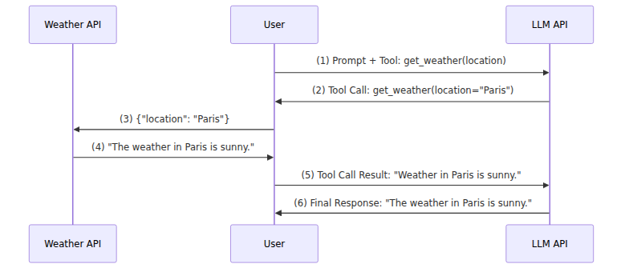

Simon Willison, a prolific software developer and writer on AI-assisted coding,
describes [AI agents](https://simonwillison.net/tags/ai-agents/) as "LLMs
calling tools in a loop to achieve a goal". It's a nice definition, particularly
if you are already familiar with the technical sense of the terms. If you
aren't, you might be wondering: What is a "tool", and how does a language model
"call" one? In this post, I want to add some technical specificity to Willison's
definition by showing how to build a very simple agent: we'll build a program in
which an LLM calls tools in a loop to achieve a goal.

Real-world agents (for example, coding agents) can be quite complicated pieces
of software. However, the core features of an agent are surprisingly simple to
implement. You might be surprised at how little code it takes to build an agent
that can do useful work! Because our goal is pedagogical, not practical, we'll
use plain Python as much as possible. If you're goal is to build a sophisticated
agent with little effort, you should probably use one of the many agent SDKs
designed for the purpose -- or just ask your coding agent to!

To follow this guide, you need an environment to run Python scripts and API
access to a large language model (LLM) provider. We will be using the DREAM
Lab’s AI gateway as our LLM provider, but other model providers should also
work.

## Using LLMs through APIs

Most computer programs, like agents, that *use* LLMs do so through web-based
APIs. Instead of running models directly, the program makes HTTP “requests” to
an LLM model provider over the web. Agents talk to model providers the same way
your web browser talks to web servers: using HTTP. An advantage of this approach
is that it makes the software easier to write and run. We don’t need specialized
hardware for running models, and we don’t need to complex machine learning
frameworks (like PyTorch). Instead, we just need an HTTP client, like Python’s
[requests](https://pypi.org/project/requests/) library.

Model providers (like Open AI, Anthropic, Google, AWS, etc.) expect programs to
use specific APIs to interact with their LLMs. Open AI’s [Chat Completion
API](https://developers.openai.com/api/reference/resources/chat), is one of the
oldest and most widely supported APIs for interacting with LLMs--and it’s the API
we’ll use here.

To make HTTP requests to an LLM provider using the Chat Completion API, you need
three things: the API’s base URL, the name of the model you want use, and an API
access key. 

The core of our agent will be Python function that uses the `requests` library
to make HTTP requests to an LLM model provider using the Chat Completion API. 

```python
import requests
import os

# call_llm makes a request using the Chat Completion API.
def call_llm(messages, api_base_url, api_model, api_key, tools=None):
    # http request url and headers
    request_url = f"{api_base_url}/v1/chat/completions"    
    headers = {"Authorization": f"Bearer {api_key}", "Content-Type": "application/json"}
    
    # http request body: the data submitted to the API
    data = {
        "model": api_model,
        "messages": messages,
    }

    # include "tools" only if defined
    if tools:
        data["tools"] = tools

    # call the API and print server error if we get one
    response = requests.post(request_url, headers=headers, json=data, timeout=60)
    try:
        response.raise_for_status()
    except requests.exceptions.HTTPError as e:
        print(f"Server Error: {response.text}")
        raise e

    # The Chat Completion API supports multiple "choices".
    # We only expect one: return the first message in 'choices'
    resp = response.json()
    return resp["choices"][0]["message"]
```

The `call_llm()` function takes as input a "messages" list and API parameters:

- `messages`: a list of chat completion message objects (more on this next).
- `api_base_url`: the URL of our API endpoint (`https://litellm.dreamlab.ucsb.edu`)
- `api_model`: the name of the model we want to use (`gemini-3-flash-preview`)
- `api-key`: a personal API key to authorize our requests.
- `tools`: an *optional* list of tool definition (we'll come back to this).

The functions output is a new "message" object with the LLM's response. 

## Chat Completion Message Structure

The Chat Completion API expects a list of message objects representing the conversation history. This structured format allows the model to understand the context of a multi-turn dialogue. Every time you make a request, you send the entire conversation history (the `messages` list) back to the provider so the model remembers what was previously said.

Each message in the list is a JSON-like dictionary that must contain specific keys. The most common keys are:

- **`role`**: Specifies who is sending the message. This can be one of four main roles:
  - `system`: Used to set instructions, constraints, or the persona for the assistant (e.g., `"You are a helpful coding assistant."`). System messages are usually placed at the very beginning of the list.
  - `user`: Represents messages or queries sent by the human user.
  - `assistant`: Represents responses generated by the language model itself. Keeping track of assistant messages is crucial for maintaining a coherent conversation history.
  - `tool`: Represents the output returned from a local function or tool call (which we will look at in the next section).
- **`content`**: The actual text content of the message. For most user and system messages, this is a string. For some assistant responses (such as those initiating tool calls) or tool responses, this may be `None` or contain structured data.

An example of a single user message is:
```python
{"role": "user", "content": "What is the weather in Paris?"}
```

By passing a sequence of these objects, you build up a complete transcript of the conversation for the model to reference and build upon.


To use this function with the DREAM Lab's AI Gateway, we could write a script
like the following.

```python
import os

api_base_url = "https://litellm.dreamlab.ucsb.edu"
api_model = "gemini-3-flash-preview"
api_key = os.getenv("LLM_API_KEY")  # key stored as environment variable

# messages with initial user prompt
messages = [{
    "role": "user",
    "content": "What is the weather in Paris"
}]

msg = call_llm(messages, api_base_url, api_model, api_key)

# the LLM's generated text is included as 'content'
print(msg["content"])
```

When I ran this script, I received the response:

```md
As of right now in Paris, France:

*   **Temperature:** 13°C (55°F)
*   **Conditions:** Clear skies and sunny.
*   **Wind:** 11 km/h (7 mph)
*   **Humidity:** 61%

**Forecast for the rest of today:**
It is expected to stay clear and cool throughout the evening, with temperatures dropping to a low of about 7°C (45°F) overnight. 

**Tomorrow's Outlook:**
Similar weather is expected tomorrow, with mostly sunny skies and a high of 14°C (57°F).
```

The response you get back will likely be inaccurate (it was for me). In fact,
running the script multiple times will likely result in completely different
descriptions! That's because the model doesn't actually know what the current
weather in Paris is, so it makes up. It "hallucinates" a plausible description.

## Use 'Tools' to Avoid Hallucinations

One way to avoid hallucinations in LLM API responses is by providing the model
with "tools" that it can use. Tools provide LLMs with ways to access high
quality information or perform tasks, and to avoid having to fill-in missing
details with statistically likely text. To illustrate, we first need to define a
`get_weather` tool, and include it with our request. How does the LLM API
response change?

```python
# get_weather_schema is metadata describing the `get_weather` tool
# to include in the llm requests. It describes what the function
# does and its required parameters. This structure conforms with the
# Chat Completion API (`ChatCompletionTool`).
get_weather_schema = {
    "type": "function",
    "function": {
        "name": "get_weather",
        "description": "Get the current weather in a given location",
        "parameters": {
            "type": "object",
            "properties": {
                "location": {
                    "type": "string",
                    "description": "A place name (e.g., Paris)",
                }
            },
            "required": ["location"],
        },
    },
}

# same prompt, api_base_url, api_model, and api_key as before
msg = call_llm(api_base_url, api_model, api_key, 
    messages = messages,
    tools = [get_weather_schema]
)
print(msg["content"]) # "None"
print(msg["too_calls"][0][function]) # {'arguments': '{"location": "Paris"}', 'name': 'get_weather'}
```

The response doesn't include text in the `content` key like before; instead,
what we get is a list of `tool_calls`, each with a `function` value like this:

```json
{"arguments": '{"location": "Paris"}', "name": 'get_weather'}`
```

What is happening here? Instead of generating direct response to the prompt, the
LLM API has responded with a `tool_call`. As the name suggests, "tool calls" are
how the API calls (or invokes) the tools we included in the request. Our request
included the `get_weather` tool definition, and the response includes a tool
call to run the `get_weather` function with arguments `{"location": "Paris"}`.
The expectation is that we will run `get_weather()` and provide the LLM with the
output so that it can provided a response grounded in facts. 

To achieve this, we need to create a `get_weather()` function that we can call.
We'll use https://wttr.in as it provides a free, simple API that is sufficient
for our purposes:

```py
# get_weather is our implementation of the function described in
# get_weather_schema. It gets the current weather for a given location 
# using a weather API (wttr.in)
def get_weather(location: str) -> str:
    url = f"https://wttr.in/{location}?format=3"
    try:
        response = requests.get(url, timeout=10)
        response.raise_for_status()
        return response.text.strip()
    except Exception as e:
        return f"Could not get weather for {location}: {e}"

get_weather("Paris") # "paris: ☁️  +56°F"
```

To provide the LLM with the result of the tool call (`"paris: ☁️ +56°F"`), we
need make a new request that includes all the previous messages *plus* a new
message with the tool call output. (That's three messages in total: (1) our
initial prompt, (2) the LLM API's response with the tool call, and (3) the tool
call output).

Here's how the complete sequence with the LLM API:


```python
prompt = "What is the weather in Paris?"
messages = [{"role": "user", "content": prompt}]
tools = [get_weather_schema] # previously defined

# initial request
msg = call_llm(messages=messages, tools=tools)
messages.append(msg)

# handle tool calls
if "tool_calls" not in msg:
    print("expected a tool call, got content:", msg.get("content"))
    raise ValueError("No tool calls found in the response")
for call in msg["tool_calls"]:
    args = json.loads(call["function"]["arguments"])
    name = call["function"]["name"]
    if name != "get_weather":
        raise ValueError(f"function name is not 'get_weather', got {name}")
    result = get_weather(**args)
    new_msg =  {"role": "tool", "tool_call_id": call["id"], "content": str(result)}
    messages.append(new_msg)

# final request
msg = call_llm(messages=messages, tools=tools)
print(msg["content"]) # The weather in Paris is currently 56°F and cloudy.
```

The sequence of the communication between the user (us) and the various APIs is as follows:

1. `call_llm()`: initial prompt message + tool definitions (`get_weather(location)`)
2. LLM API responds with tool call: `get_weather("location" = "Paris")`
3. `get_weather()`: request to Weather API: `{"location": "Paris"}`
4. Weather API response: "The weather in Paris is sunny."
5. `call_llm()`: tool call output: "The weather in Paris is sunny."
6. LLM API's final response to the prompt: "The weather in Paris is sunny."
 


