The prolific software developer and writer on AI-assisted coding, Simon Willison,
describes [AI agents](https://simonwillison.net/tags/ai-agents/) as "**LLMs
calling tools in a loop to achieve a goal**". It's a good definition,
particularly if you are already familiar with the technical sense of the terms.
If you aren't, you might be wondering: What is a "tool", and how does a language
model "call" one? In this post, I want to add some technical specificity to
Willison's definition by showing how to build a very simple agent: we'll build a
program in which an LLM calls tools in a loop to achieve a goal.

Real-world agents (for example, coding agents) can be quite complicated pieces
of software. However, the core features of an agent are surprisingly simple to
implement. You might be surprised at how little code it takes to build an agent
that can do useful work! Because our goal is pedagogical, not practical, we'll
use plain Python as much as possible. If your goal is to build a sophisticated
agent with little effort, you should probably use one of the many agent SDKs
designed for the purpose -- or just ask your coding agent to!

To follow this guide, you need an environment to run Python scripts and API
access to a large language model (LLM) provider. We will be using the DREAM
Lab’s AI gateway as our LLM provider, but other model providers should also
work.

## Using LLMs through APIs

Most computer programs, like agents, that *use* LLMs do so through web-based
APIs. Instead of running models directly, the program makes HTTP “requests” to
an LLM model provider over the web. Agents talk to model providers the same way
your web browser talks to web servers: using HTTP. An advantage of this approach
is that it makes the software easier to write and run. We don’t need specialized
hardware for running models, and we don’t need complex machine learning
frameworks (like PyTorch). Instead, we just need an HTTP client, like Python’s
[requests](https://pypi.org/project/requests/) library.

Model providers (like OpenAI, Anthropic, Google, AWS, etc.) expect programs to
use specific APIs to interact with their LLMs. OpenAI’s [Chat Completion
API](https://developers.openai.com/api/reference/resources/chat), is one of the
oldest and most widely supported APIs for interacting with LLMs--and it’s the API
we’ll use here.

To make HTTP requests to an LLM provider using the Chat Completion API, you need
four things: a prompt (or "message"), the API’s base URL, the name of the model
you want use, and an API access key. 

The core of our agent is a Python function, `call_llm()`, that uses the
`requests` library to make HTTP requests to an LLM model provider using the Chat
Completion API. 

```python
import requests
import os

def call_llm(messages, api_base_url, api_model, api_key, tools=None):
    """Makes a request using the Chat Completion API.

    Args:
        messages (list): A list of "message" objects, described in more detail below.
        api_base_url (str): The URL of our API endpoint (ex: `https://litellm.dreamlab.ucsb.edu`).
        api_model (str): Name of the model to use (ex: `gemini-3-flash-preview`).
        api_key (str): An API key to authorize the request.
        tools (list, optional): An optional list of tool definitions.

    Returns:
        dict: The first message object in the response choices.
    """

    # http request url and headers
    request_url = f"{api_base_url}/v1/chat/completions"    
    headers = {
        "Authorization": f"Bearer {api_key}", 
        "Content-Type": "application/json"
    }
    
    # http request body: the data submitted to the API
    data = {
        "model": api_model,
        "messages": messages,
    }

    # include "tools" only if defined
    if tools:
        data["tools"] = tools

    # call the API and print server error if we get one
    response = requests.post(request_url, headers=headers, json=data)
    response.raise_for_status() # raise an error if http response status != 200
   
    # The Chat Completion API supports multiple "choices".
    # We only expect one: return the first message in 'choices'
    resp = response.json()
    return resp["choices"][0]["message"]
```

The `call_llm()` function takes several arguments, but the primary input for the
LLM is the list of `messages`; the function also returns a new message object
with the output from the LLM. Let's take a closer look at what these "message"
objects consist of.

## Chat Completion Message Structure

The Chat Completion API expects a list of message objects representing the
conversation history. The message list represents the full context of a
multi-turn dialogue, typically between a "user" and the LLM "assistant". The
entire conversation history (the `messages` list) must be included with each
request, otherwise the LLM won't "remember" the full context of the
conversation.

Messages are json objects (Python dicts) with `role` and `content` keys:

- **`role`**: Specifies who is sending the message. This can be one of four main
  roles: `user`, `assistant`, `tool`, or `system`.
- **`content`**: The actual text content of the message.
- Messages may include additional keys for tool calling. We'll come back to this.

We'll talk about the "tool" role a little later (and we're mostly ignoring the
"system" role in this guide). In a simple, chat-based exchange (without tool
calls), the "messages" list consists of alternating "user" and "assistant"
messages. To illustrate, let's use `call_llm()`, with a single prompt: "What is
the weather in Paris?"

```python
import os

# messages with initial prompt (user role)
prompt = "What is the weather in Paris"
messages = [{"role": "user", "content": prompt}]

# api config
api_base_url = "https://litellm.dreamlab.ucsb.edu"
api_model = "gemini-3-flash-preview"
api_key = os.getenv("LLM_API_KEY")  # key stored as environment variable

msg = call_llm(messages, api_base_url, api_model, api_key)

# msg has assistant role with API response
print(msg) # {"role": "assistant", "content": "The weather in Paris is ..."}
```

To continue the conversation, we would append the assistant response (`msg`) to
the `messages` list and then add an additional user message:

```python
# messages = [{"role": "user", "content": "What is the weather in Paris?"}]
# msg = call_llm(messages, api_base_url, api_model, api_key)

# append assistant response message list
messages.append(msg) 

# append new user prompt to message list
messages.append({"role": "user", "content": "temperature in C and F please!"})

# second assistant response
msg = call_llm(messages, api_base_url, api_model, api_key)
messages.append(msg)
```

The final `messages` list would include the following:

| `role`      | `content`                                 |
| :---------- | :---------------------------------------- |
| `user`      | `"What is the weather in Paris?"`         |
| `assistant` | `"The weather in Paris is ..."`           |
| `user`      | `"temperature in C and F please!"`        |
| `assistant` | `"It is 13°C (55°F) with clear skies..."` |


## Use 'Tools' to Avoid Hallucinations

When I ran this script above, with the prompt "What is the weather in Paris?", I received the response:

```md
As of right now in Paris, France:

*   **Temperature:** 13°C (55°F)
*   **Conditions:** Clear skies and sunny.
*   **Wind:** 11 km/h (7 mph)
*   **Humidity:** 61%

**Forecast for the rest of today:**
It is expected to stay clear and cool throughout the evening, with temperatures dropping to a low of about 7°C (45°F) overnight. 

**Tomorrow's Outlook:**
Similar weather is expected tomorrow, with mostly sunny skies and a high of 14°C (57°F).
```

At the time, this description was not accurate. In fact, running the script
multiple times returned completely different weather conditions! That's because
the model doesn't actually know what the weather in Paris is, so it makes up the
answer. It "hallucinates" a plausible description of the weather. One way to
avoid hallucinations in LLM API responses is to provide the model with "tools"
that it can use. Tools provide LLMs with ways to access current information,
perform tasks, and avoid having to fill-in missing details with statistically
likely text. 

To illustrate how tools work, we'll create a tool called `get_weather` that
returns current weather conditions for a given location. For now, we're not
concerned with *implementing* the tool. First, we just want to change our
request so that the LLM API is aware of the tool.

The optional `tools` argument of our `call_llm()` function is used to provide
the LLM API with structured descriptions of tools it can call. In this context,
you can think of "tools" as metadata describing a function in terms of inputs
and outputs. Here's how we would describe our `get_weather` tool using the Chat
Completion API:

```python
# get_weather_schema describes the `get_weather` tool.
get_weather_schema = {
    "type": "function",
    "function": {
        "name": "get_weather",
        "description": "Get the current weather in a given location",
        "parameters": {
            "type": "object",
            "properties": {
                "location": {
                    "type": "string",
                    "description": "A place name (e.g., Paris)",
                }
            },
            "required": ["location"],
        },
    },
}
```

Now let's see how our response changes when we include this tool (`get_weather_schema`).

```python
prompt = "What is the weather in Paris"
messages = [{"role": "user", "content": prompt}]

# same prompt, api_base_url, api_model, and api_key as before
msg = call_llm(messages, api_base_url, api_model, api_key, tools = [get_weather_schema])

# print response details
print(msg["role"])    # "assistant"
print(msg["content"]) # None
print(msg["too_calls"][0][function]) # {"arguments": "{'location': 'Paris'}", "name": "get_weather"}`
```

The response has changed in a few ways. First, it doesn't include any `content`
(the `content` key is still present in the response message, but its value is
`None`). Second, there is a new key, `tool_calls`, which is a list of objects
like this:

```json
{"arguments": "{'location': 'Paris'}", "name": "get_weather"}`
```

As the name suggests, "tool calls" are how the API calls (or invokes) the tools
we included in the request. Our request included the `get_weather` tool
definition, and the response includes a tool call to run the `get_weather`
function with arguments `{"location": "Paris"}`. The expectation is that we will
run `get_weather()` and make an additional request with the output
from the tool call. 

It's time to implement the `get_weather()` function so that we can call it from
our Python code. We'll use https://wttr.in as it provides a free, simple API
that is sufficient for our purposes:

```py
# get_weather is our Python implementation of the `get_weather` tool.
# It gets the current weather for a given location using a weather
# API (wttr.in)
def get_weather(location: str) -> str:
    url = f"https://wttr.in/{location}?format=3"
    try:
        response = requests.get(url, timeout=10)
        response.raise_for_status()
        return response.text.strip()
    except Exception as e:
        return f"Could not get weather for {location}: {e}"

# example
get_weather("Paris") # "Paris: ☁️  +56°F"
```

Now that we have implemented `get_weather`, we can call the Python function
using the arguments in the tool call, and then send the output back to the LLM.
The tool call output is included in the message of a second request, using the
`"tool"` role.


```python
# continuing from above ...
# msg = call_llm(messages, api_base_url, api_model, api_key, tools = [get_weather_schema])

# run tool call in response:
for call in msg["tool_calls"]:

    # parse tool call function name and arguments
    name = call["function"]["name"]
    if name != "get_weather":
        raise ValueError(f"unexpected function name: {name}")
    args = json.loads(call["function"]["arguments"])
    result = get_weather(**args)
    
    # message with tool call output
    new_msg =  {
        "role": "tool",
        "tool_call_id": call["id"],
        "content": str(result),
    }
    messages.append(new_msg)

# final request with tool call results
msg = call_llm(messages, api_base_url, api_model, api_key, tools = [get_weather_schema])
messages.append(msg)
print(msg["content"]) # The weather in Paris is currently 56°F and cloudy.
```

The final message sequence to/from the LLM API is represented in the table
below. Note that the tool output is sent to the LLM API using a message with
`"tool"` role, not the typical `"user"` role.

| Role        | Content / Tool Call                                                          |
| :---------- | :--------------------------------------------------------------------------- |
| `user`      | "What is the weather in Paris?"                                              |
| `assistant` | tool call: `{"arguments": "{'location': 'Paris'}", "name": "get_weather"}` |
| `tool`      | "Paris: ☁️  +56°F"                                                         |
| `assistant` | "The weather in Paris is currently 56°F and cloudy"                          |

## Calling Tools in a Loop 

Let's revisit Willison's definition. AI agents are "**LLMs calling tools in a
loop to achieve a goal**. At this point, we have a better understanding of how
LLMs call tools: we include descriptions of available tools in our requests; the
response may include `tool_calls`; we process tool calls locally and send the
output back using the `"tool"` role. In the code above, we only processed the
tool calls for a single response message. If the LLM API responded to the first
tool call with a second (for example, if the first didn't work as expected), the
second tool call would be ignored. We can address this by continuing to process
tool calls, and making new requests to the LLM API with tool output, until we
stop receiving responses with tool calls.

This is the idea of "calling tools in a loop": as long as the LLM API continues
to respond with tool calls, the agent continues to handle the calls and make new
requests with the results. The "agent loop" (represented on the right-hand side
of the figure below) is only broken when the LLM API stop responding with tool
calls.



To implement an agent in Python, we will create a function called `agent_loop()`
that makes a request, runs tools, and makes additional requests until the LLM
response no longer contains `tool_calls`. Notice that the `tools` argument
expected by `agent_loop()` differs from the `tools` argument of `call_llm()`.
While `call_llm()` only expects tool schemas (metadata) to pass to the API,
`agent_loop()` expects a list of tuples containing both the schema *and* the
executable Python function. The agent loop needs both because it making API
requests and also processing tools.

```python
import json

def agent_loop(prompt, api_base_url, api_model, api_key, tools=None):
    """
    Run the main agent loop, interacting with the LLM and executing any requested tools.
    Returns list of messages from the agent's interaction.
    """
    tools = tools or []

    # Separate schemas for the API and build a dictionary of implementations
    tool_schemas = [schema for schema, func in tools]
    tool_funcs = {schema["function"]["name"]: func for schema, func in tools}

    # messages is our full context. Initially, just the user prompt
    messages = [{"role": "user", "content": prompt}]
    
    while True:
        # Call the LLM with the current conversation history and available tool schemas
        msg = call_llm(messages, api_base_url, api_model, api_key, tools=tool_schemas)
        messages.append(msg)

        # break the loop when the response is not a tool call
        if not msg.get("tool_calls"):
            break

        # run all tool calls in the message and append tool call results to messages
        for call in msg.get("tool_calls", []):
            args = json.loads(call["function"]["arguments"])
            name = call["function"]["name"]

            if name in tool_funcs:
                func = tool_funcs[name]
                try:
                    result = func(**args)
                except Exception as e:
                    result = f"Error executing {name}: {e}"
            else:
                result = f"Error: Tool {name} not found."

            messages.append(
                {"role": "tool", "tool_call_id": call["id"], "content": str(result)}
            )

    return messages
```

## Adding Multiple Tools

The real power of an agent loop becomes apparent when we provide the LLM with
multiple tools. The model can then orchestrate calling these tools in sequence
to achieve a multi-step goal. Let's add a second tool, `send_message`, which
simulates sending a message to a specific recipient. 

First, we define the tool definition for `send_message`:

```python
# send_message_schema describes the `send_message` tool
send_message_schema = {
    "type": "function",
    "function": {
        "name": "send_message",
        "description": "send a message to someone",
        "parameters": {
            "type": "object",
            "properties": {
                "to": {
                    "type": "string",
                    "description": "the person to send the message to",
                },
                "message": {
                    "type": "string",
                    "description": "the body of the message",
                },
            },
            "required": ["to", "message"],
        },
    },
}
```

Next, we provide a Python implementation of `send_message`. For demonstration
purposes, we will simply store the messages in a dictionary acting as an inbox
for multiple users.

```python
# A fake email inbox to store messages
inboxes = {}

def send_message(to: str, message: str):
    to_key = to.lower()
    if to_key not in inboxes:
        inboxes[to_key] = []
    inboxes[to_key].append(message)
    return f"Message sent to {to}"
```

Now, we can give our agent a more complex prompt: *"Send a message to Tom about
the weather in Paris."* For the agent loop, `tools` includes both the tool
definitions and the tool implementations as tuples.

```python
prompt = "Send a message to Tom about the weather in Paris."
tools = [
    (get_weather_schema, get_weather),
    (send_message_schema, send_message)
]

messages = agent_loop(prompt, api_base_url, api_model, api_key, tools=tools)
```

The complete list of messages returned from `agent_loop()` looks like this:

| Role        | Content / Tool Call                                                          |
| :---------- | :--------------------------------------------------------------------------- |
| `user`      | "Send a message to Tom about the weather in Paris."                          |
| `assistant` | tool call: `{"arguments": "{'location': 'Paris'}", "name": "get_weather"}` |
| `tool`      | "Paris: ☁️  🌡️+59°F 🌬️↘9mph"                                                 |
| `assistant` | tool call: `{"arguments": "{'to': 'Tom', 'message': 'The current weather in Paris is ☁️ 59°F with a 9mph wind.'}", "name": "send_message"}` |
| `tool`      | "Message sent to Tom"                                                        |
| `assistant` | "OK. I've sent that message to Tom."                                         |

Reading the message list, we can see that the LLM responded to the initial
prompt with two tool calls in a row: the first to get the weather in Paris, and
the second to send the message to Tom. The final message from the LLM
"assistant" confirms that that message was sent. The agent loop ends because
this message doesn't include additional tool calls.

We can also confirm that Tom received a message:

```python
print(inboxes["tom"])
# ['The current weather in Paris is ☁️ 59°F with a 9mph wind.']
```

We gave the LLM a goal, we gave it relevant *tools*, and it used those
tools to achieve a goal!
