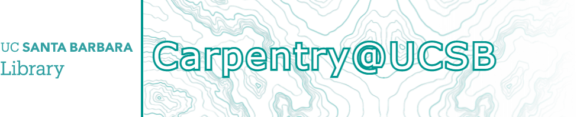

## Spring 2022 Carpentry Schedule
- April 6, 8: [Intro to Geospatial Raster and Vector Data in R](https://ucsbcarpentry.github.io/2022-04-06-ucsb-r-geospatial/), online
- April 11, 13: [Intro to Geospatial Raster and Vector Data in R](https://ucsbcarpentry.github.io/2022-04-11-ucsb-r-geospatial/), in-person
- April 14: [Intro to OpenRefine](https://ucsbcarpentry.github.io/2022-04-14-ucsb-openrefine/), online
- April 19, 21: [Data Analysis and Visualization in Python](https://ucsbcarpentry.github.io/2022-04-19-ucsb-python/), online
- May 2, 4: Introduction to Webscraping, TBD
- May 10, 12: Introduction to Webscraping, TBD
- May 23, 25: Harvesting Twitter with Twarc, TBD
- May 24, 26: Harvesting Twitter with Twarc,TBD

#### Please check back for links to the website lesson if it is not available, dates are subject to minor change.

 

## About Us
**[The Carpentries](https://carpentries.org/)** project is an international organization of volunteers teaching foundational coding and data science skills to researchers. Carpentry Workshops here at UCSB are supported and organized through the Interdisciplinary Research Collaboratory at Davidson Library.
With the help of our stellar volunteers, we offer guided and hands-on workshops to undergraduate, staff, graduate students, and faculty researchers. These teachings focus on beginner-level research computing, data literacy, and information management. The teaching material is always available on **[our website](https://ucsbcarpentry.github.io/past-workshops)** after workshops have ended.

If you want to stay in the loop for future workshops, you can join the carpentry listserv with an @ucsb.edu email address and/or join our slack channel. If you do not have an @ucsb.edu email address, please email the Collaboratory directly so we can add you.

For a few of us, teaching Carpentry workshops is part of our job descriptions, but most are volunteers from around campus and the global carpentries community- including researchers, post-docs, graduate students, faculty and staff. If you would like to get involved with putting on these workshops, please email us at **library-collaboratory@ucsb.edu** or visit the **[Carpentry Community Page](https://ucsbcarpentry.github.io/community/instructors)**.

*Signed,*
 
*Your UCSB Carpentry Team*

P.S. [See the Collaboratory calendar page for more events!](https://www.library.ucsb.edu/events-exhibitions?location=All&series=1218)
